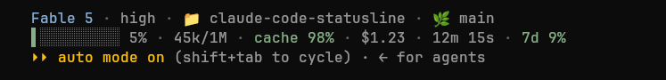

# claude-code-statusline

A two-line status line for [Claude Code](https://code.claude.com), plus a matching renderer for the subagent panel. Pure Python, standard library only.



**Line 1:** model · reasoning effort · directory · git branch
**Line 2:** context bar · % · tokens · cache hit rate · cost · elapsed time · weekly limit

## Design notes

- **The context bar warns you early.** Its colour comes from two independent checks, both always active — the harsher one wins:

  | | 🟡 amber | 🔴 red | Why |
  |---|---|---|---|
  | Conversation size | 120k tokens | 350k tokens | context rot: long context makes any model worse |
  | Window used | 55% | 75% | distance to auto-compact (~83%), which loses detail |

  When the bar turns red, wrap up what you're doing or start a fresh session.
- **The cache percentage watches your costs.** Claude charges a fraction of the price for parts of the conversation it has already processed. In a healthy session this number sits at 95–99%. A sudden drop means something invalidated that saved prefix — the next requests get slower and more expensive, and the status line makes it visible the moment it happens.
- **It never leaves you with a blank bar.** Missing data renders as placeholders and any internal error shows up as a short note, so the status line keeps working whatever the payload looks like.
- **It's instant.** Everything is read from files already on disk, with zero external commands, so rendering takes a few milliseconds even on slow machines.

## Requirements

- Python 3.8+
- Claude Code 2.x. Subagent rows show model and context window on 2.1.205+, reasoning effort on 2.1.214+; older versions simply omit those fields.

## Install

```bash
cp statusline.py subagent-statusline.py ~/.claude/
chmod +x ~/.claude/statusline.py ~/.claude/subagent-statusline.py
```

Add to `~/.claude/settings.json`:

```json
{
  "statusLine": {
    "type": "command",
    "command": "~/.claude/statusline.py",
    "refreshInterval": 10
  },
  "subagentStatusLine": {
    "type": "command",
    "command": "~/.claude/subagent-statusline.py"
  }
}
```

If you've moved your Claude Code config with the `CLAUDE_CONFIG_DIR` environment variable, copy the scripts to that directory and point the `settings.json` paths there; the scripts read the variable too and keep their cache files in the same place.

## License

This project is licensed under the MIT License — see the [LICENSE](LICENSE) file for details.
